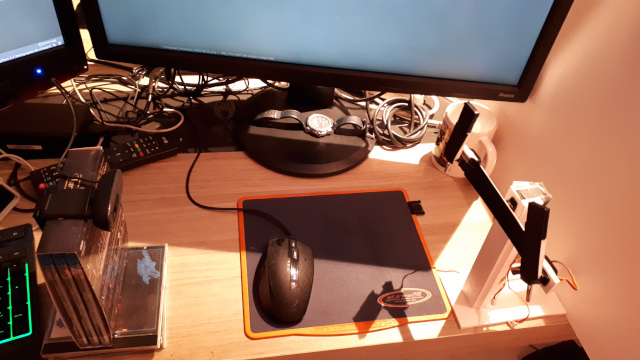
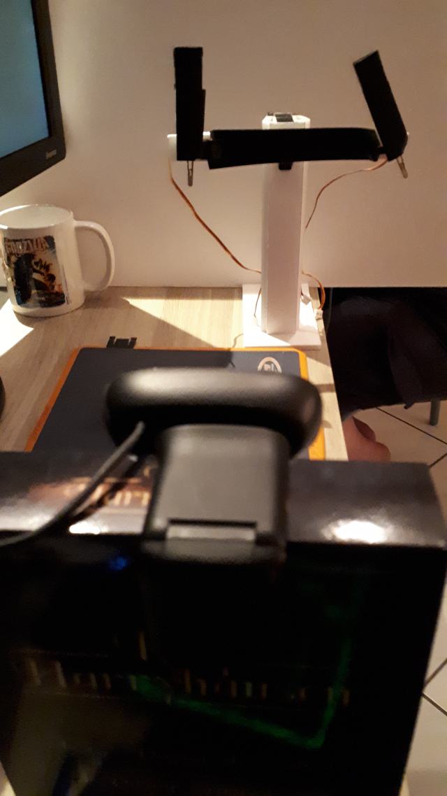
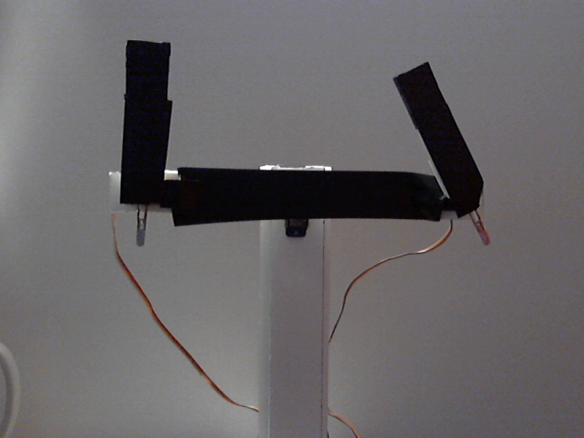
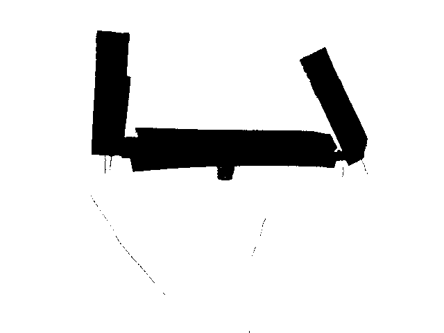

# Optical reading Chappe telegraph
#### Principle
- There is a Chappe telegraph powered by 3 servos motors and an Arduino card (Check the Arduino part on this project: https://github.com/Ilard/telegraphechappe_arduino).
- A camera read the telegraph symbols with a PC.
- The telegraph symbol is compared with a symbol's catalog.
- Each symbol corresponds to a numeric code.
- This corresponding code is send in JSON format to a web server and displayed on a web page (Check web development in this project: https://github.com/Ilard/telegraphechappe_web).

#### Technical platform
- PC with GNU Linux Debian 10.0 Testing.
- Webcam.
- Python 3.7.4.
- OpenCV library for optical reading.
- Requests library to send JSON data to a web server.

#### Simple schematic

```sh
   Chappe             Web camera          Web server       Display
  telegraph           with a PC           with JSON        symbol
   symbol             Python app          connection       & code

        \               _____               ______               \
  +--|--+     =[]      | PC  |             |      |        +--|--+
  |  |          |______|_____|--network-->-|server|--->--- |  |
     |                 /_____/             |______|           |
  Arduino    Webcam  optical work        Web animation     Web Page
```

#### Telegraph and webcam installation
Telegraph and webcam in situation.





#### Camera view
This is what camera is watching :
- The Chappe telegraph symbol is in black color.
- The background is white.
- So the Python app job is to separate the black and white colors to isolate de right symbol.



#### Python application processing
In fact, there is the result of the process  :
- The color captured by the webcam is converted into grey scale.
- The threshold is set to 53 (0 up to 255) for this test.
- Note that the threshold value is depending of the light of the room.


